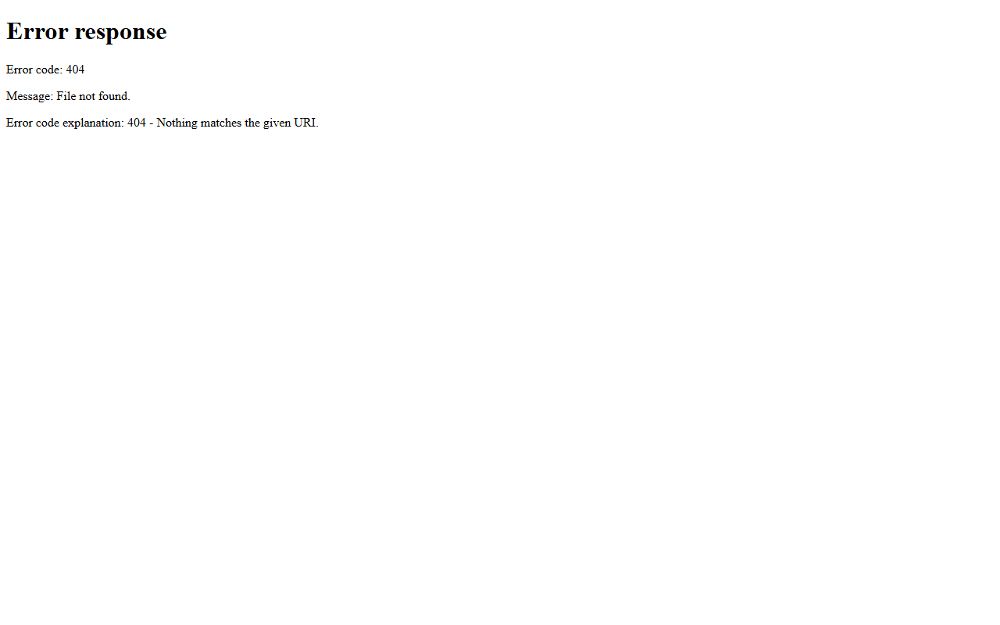

# Online Food Delivery System

A sample Online Food Delivery Web Application developed using Node.js and MongoDB.

## Screenshots

## Features
- Browse restaurants
- Place food orders
- Payment module
- Order tracking

## Technologies Used
- Node.js
- Express.js
- MongoDB
- Git
- GitHub
- Docker
- Jenkins

## DevOps Workflow
Git → GitHub → Jenkins → Docker

## Author
Muhammad Afzal